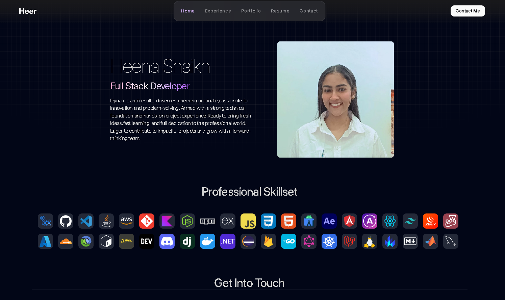
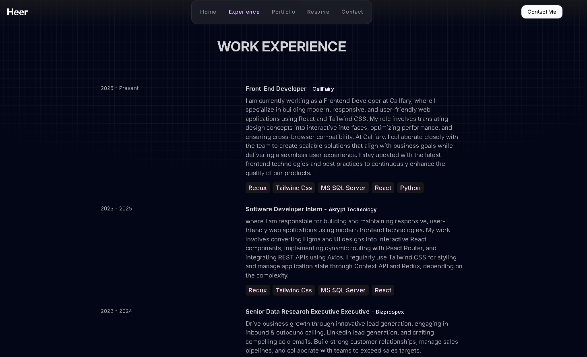
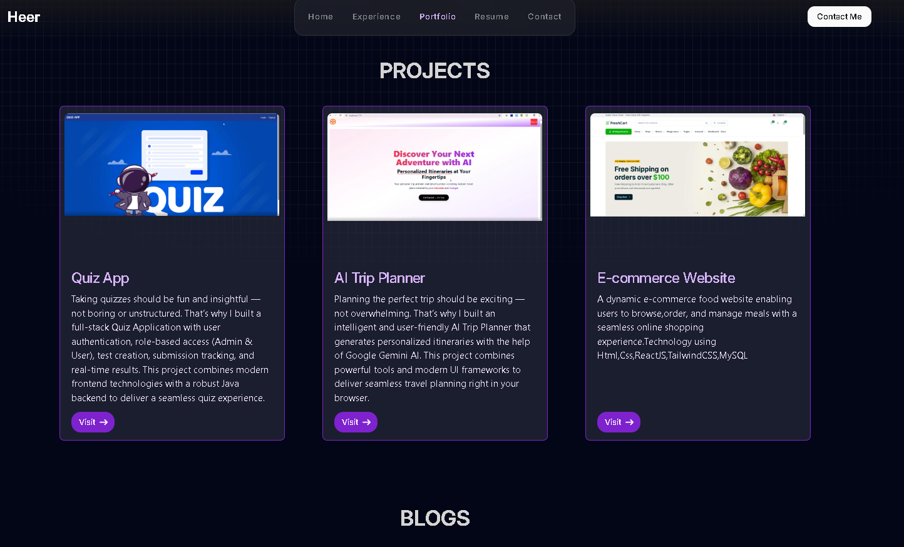
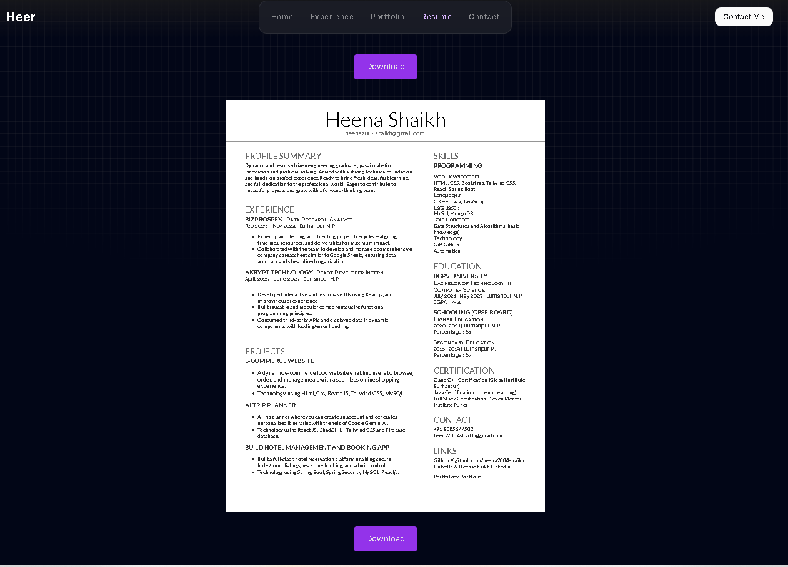
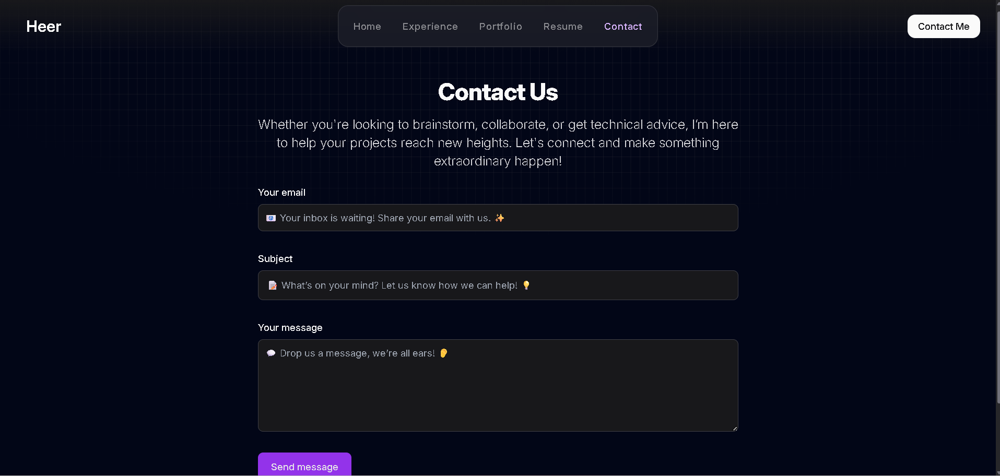

# Heena's Portfolio Website 🚀

A beautifully crafted portfolio website created by me. This portfolio showcases my journey, projects, and technical expertise through an interactive and animated interface.

## ⚡ Tech Stack

<div align="center">
  
  
  
  
  
</div>

## 🌐 Live Demo

[](https://heenashaikh.netlify.app/)

## 📸 Website Preview

### Home Section



### Work Experience



### Portfolio Gallery


### Interactive Resume



### Contact Form



## 🌟 Features

### 🏠 Home
Step into Heena's digital world with a dynamic landing page featuring smooth animations powered by Framer Motion. Get to know his expertise and passion for development through an engaging introduction that highlights his professional journey.

### 💼 Work Experience
Explore Heena's professional journey through an interactive timeline of projects and achievements. Each entry is beautifully animated and provides detailed insights into his contributions and the technologies utilized.

### 🎨 Portfolio
Discover Heena's projects through an animated gallery that showcases his technical versatility. Each project card reveals detailed information about:
- Project objectives and challenges
- Technical implementation details
- Live demos and GitHub repositories
- Key learnings and outcomes

### 📄 Resume
Access Heena's professional background through an interactive resume section featuring:
- Downloadable PDF format
- Smooth rendering with react-pdf
- Responsive design for all devices
- Detailed skill breakdown and certifications

### 📬 Contact
Connect with Heena through a modern, responsive contact form. The section includes:
- Direct email integration
- Social media links
- Professional networks
- Response time expectations

## 🚀 Getting Started

```bash
# Clone the repository
git clone https://github.com/yourusername/portfolio-website.git

# Navigate to project directory
cd portfolio-website

# Install dependencies
npm install

# Start development server
npm run dev

# Build for production
npm run build
```

## 📱 Responsive Design

The portfolio is fully responsive and optimized for:
- Desktop displays
- Tablets
- Mobile devices
- Various screen orientations

## ✨ Animation Features

Powered by Framer Motion, the website includes:
- Smooth page transitions
- Scroll-triggered animations
- Interactive hover effects
- Dynamic loading states

## 🔍 SEO Optimization

Implemented with industry best practices:
- Custom meta tags for each section
- Semantic HTML structure
- Optimized loading performance
- Social media preview cards

## 📄 License

This project is licensed under the MIT License - see the [LICENSE.md](LICENSE.md) file for details.

## 🤝 Connect With Heena

Feel free to reach out and connect with Heena on:

<div align="center">
  <a href="https://www.linkedin.com/in/heena-shaikh-556731353/" target="_blank">
    
  </a>
  <a href="https://github.com/heena2004shaikh" target="_blank">
    
  </a>
</div>

---